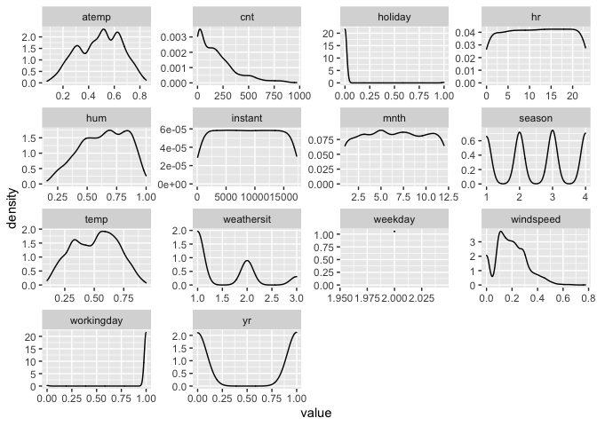
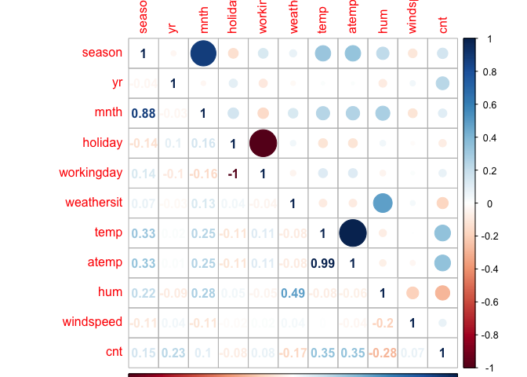

Project2
================
Lin Li

# Introduction

For this project, I will use bike sharing data to do analysis. There are
15 variables :  
\-instant(record index)  
\-dteday(date)  
\-season(1:winter, 2:spring, 3:summer, 4:fall)  
\-yr(0: 2011, 1:2012)  
\-mnth(month: 1 to 12)  
\-hr(hour:0 to 23)  
\-holiday(weather day is holiday or not)  
\-weekday(day of week)  
\-workingday(1 for neither weekend nor holiday,0 otherwise)  
\-weathersit(1: Clear, Few clouds, Partly cloudy, Partly cloudy,2: Mist
and Cloudy, Mist andBroken clouds, Mist and Few clouds, Mist,3: Light
Snow, Light Rain and Thunderstorm and Scattered clouds, Light Rain and
Scattered clouds,4: Heavy Rain and Ice Pallets and Thunderstorm and
Mist, Snow and Fog )  
\-temp(Normalized temperature in Celsius)  
\-atemp( Normalized feeling temperature in Celsius)  
\-hum(Normalized humidity),windspeed(Normalized wind speed)  
\-cnt(count of total rental bikes including both casual and registered )

The purpose of this analysis is to create models for predicting cnt
variable using others predictors mentioned above. Two models are
created:classification tree model using leave one out cross validation,
boosted tree model using cross validation.

# Data

``` r
# relative path to read data
#getwd()
day<-read.csv('day.csv')
day<-day%>%select(-c('casual','registered'))
hour<-read.csv('hour.csv')
hour<-hour%>%select(-c('casual','registered'))
# combine two data and get a new one
data<-semi_join(hour,day,by='dteday')
# filter Monday out
date<- filter(data,weekday==params$weekday)
set.seed(100)
# set train/test set
index<-createDataPartition(date$cnt,p=0.7,list=FALSE)
trainday<-date[index,]
testday<-date[-index,]
```

# Summarization

In this section, I summarize information for Monday, draw density plots
for all variables, and plot a correlation plot for cnt with others
predictors. From density plots, I can conclude the distributions for
variables. From correlation plot, I can conclude correlation
relationships between each variable.

``` r
# summary for monday
summary(date)
```

    ##     instant             dteday         season            yr              mnth              hr       
    ##  Min.   :   70   2011-02-08:  24   Min.   :1.000   Min.   :0.0000   Min.   : 1.000   Min.   : 0.00  
    ##  1st Qu.: 4361   2011-03-01:  24   1st Qu.:2.000   1st Qu.:0.0000   1st Qu.: 4.000   1st Qu.: 6.00  
    ##  Median : 8697   2011-03-08:  24   Median :3.000   Median :1.0000   Median : 7.000   Median :12.00  
    ##  Mean   : 8666   2011-03-22:  24   Mean   :2.529   Mean   :0.5018   Mean   : 6.517   Mean   :11.62  
    ##  3rd Qu.:12904   2011-03-29:  24   3rd Qu.:3.000   3rd Qu.:1.0000   3rd Qu.: 9.000   3rd Qu.:18.00  
    ##  Max.   :17235   2011-04-05:  24   Max.   :4.000   Max.   :1.0000   Max.   :12.000   Max.   :23.00  
    ##                  (Other)   :2309                                                                    
    ##     holiday            weekday    workingday       weathersit         temp            atemp             hum        
    ##  Min.   :0.000000   Min.   :2   Min.   :0.0000   Min.   :1.000   Min.   :0.1000   Min.   :0.0758   Min.   :0.1600  
    ##  1st Qu.:0.000000   1st Qu.:2   1st Qu.:1.0000   1st Qu.:1.000   1st Qu.:0.3600   1st Qu.:0.3485   1st Qu.:0.4900  
    ##  Median :0.000000   Median :2   Median :1.0000   Median :1.000   Median :0.5200   Median :0.5000   Median :0.6600  
    ##  Mean   :0.009376   Mean   :2   Mean   :0.9906   Mean   :1.476   Mean   :0.5086   Mean   :0.4872   Mean   :0.6398  
    ##  3rd Qu.:0.000000   3rd Qu.:2   3rd Qu.:1.0000   3rd Qu.:2.000   3rd Qu.:0.6600   3rd Qu.:0.6212   3rd Qu.:0.8100  
    ##  Max.   :1.000000   Max.   :2   Max.   :1.0000   Max.   :3.000   Max.   :0.9400   Max.   :0.8485   Max.   :1.0000  
    ##                                                                                                                    
    ##    windspeed           cnt       
    ##  Min.   :0.0000   Min.   :  1.0  
    ##  1st Qu.:0.1045   1st Qu.: 36.0  
    ##  Median :0.1940   Median :147.0  
    ##  Mean   :0.1919   Mean   :191.2  
    ##  3rd Qu.:0.2836   3rd Qu.:276.0  
    ##  Max.   :0.7761   Max.   :970.0  
    ## 

``` r
# density plot
date %>%keep(is.numeric) %>%pivot_longer(everything()) %>%ggplot(aes(x = value)) +facet_wrap(~ name, scales = "free")+
geom_density()
```

<!-- -->

``` r
# all predictors' correlation with cnt variable
correlation <- cor(select(date,season,yr,mnth,holiday,workingday,weathersit,temp,atemp,hum,windspeed,cnt))
corrplot(correlation, type = "upper", tl.pos = "lt",use="pairwise.complete.obs")
corrplot(correlation, type = "lower", method = "number", add = TRUE, tl.pos = "n",use="pairwise.complete.obs")
```

<!-- -->

# Modeling

Two models are created for predicting cnt of Monday: First is
classification model using leave one out cross validation. Second is
boosted tree model with cross validation. I read in data and split into
training and test.Then centered and scaled data, and fitted models using
methods mentioned.  
Through comparing RMSE for test dataset, choose the one with smaller
RMSE as final model.

``` r
# fit model 
classification.fit<-train(cnt~season+mnth+hr+holiday+workingday+weathersit+temp+atemp+hum+windspeed,trainday,method='rpart',preProcess = c('center','scale'),trControl=trainControl(method='LOOCV'))
classification.fit
```

    ## CART 
    ## 
    ## 1719 samples
    ##   10 predictor
    ## 
    ## Pre-processing: centered (10), scaled (10) 
    ## Resampling: Leave-One-Out Cross-Validation 
    ## Summary of sample sizes: 1718, 1718, 1718, 1718, 1718, 1718, ... 
    ## Resampling results across tuning parameters:
    ## 
    ##   cp          RMSE      Rsquared      MAE      
    ##   0.07186199  129.0620  0.5244771310   90.60095
    ##   0.08598409  167.0103  0.2251229123  120.41422
    ##   0.29993187  192.0162  0.0009956996  165.20485
    ## 
    ## RMSE was used to select the optimal model using the smallest value.
    ## The final value used for the model was cp = 0.07186199.

``` r
boosted.fit<-train(cnt~season+yr+mnth+hr+holiday+workingday+weathersit+temp+atemp+hum+windspeed,trainday,method='gbm',preProcess = c('center','scale'),trControl=trainControl(method='repeatedcv'), verbose = FALSE)
boosted.fit
```

    ## Stochastic Gradient Boosting 
    ## 
    ## 1719 samples
    ##   11 predictor
    ## 
    ## Pre-processing: centered (11), scaled (11) 
    ## Resampling: Cross-Validated (10 fold, repeated 1 times) 
    ## Summary of sample sizes: 1547, 1548, 1547, 1547, 1547, 1547, ... 
    ## Resampling results across tuning parameters:
    ## 
    ##   interaction.depth  n.trees  RMSE       Rsquared   MAE     
    ##   1                   50      128.85178  0.5852011  88.90757
    ##   1                  100      113.31283  0.6727852  77.95360
    ##   1                  150      103.01658  0.7318255  70.52198
    ##   2                   50       92.64171  0.7937987  60.69612
    ##   2                  100       69.96728  0.8710188  47.38639
    ##   2                  150       64.29574  0.8861069  43.83052
    ##   3                   50       72.88699  0.8736227  48.39618
    ##   3                  100       56.10156  0.9148821  37.47646
    ##   3                  150       51.71321  0.9243905  34.37422
    ## 
    ## Tuning parameter 'shrinkage' was held constant at a value of 0.1
    ## Tuning parameter 'n.minobsinnode' was held
    ##  constant at a value of 10
    ## RMSE was used to select the optimal model using the smallest value.
    ## The final values used for the model were n.trees = 150, interaction.depth = 3, shrinkage = 0.1 and n.minobsinnode
    ##  = 10.

``` r
# predict
class<-predict(classification.fit,newdata = testday)
classRMSE<-sqrt(mean((class-testday$cnt)^2))
boost<-predict(boosted.fit,newdata = testday)
boostRMSE<-sqrt(mean((boost-testday$cnt)^2))
#RMSE for classification model and boost model
x<-c(classification=classRMSE,boost=boostRMSE)
knitr::kable(x,col.names =' RMSE')
```

|                |      RMSE |
| :------------- | --------: |
| classification | 124.32403 |
| boost          |  46.73496 |
