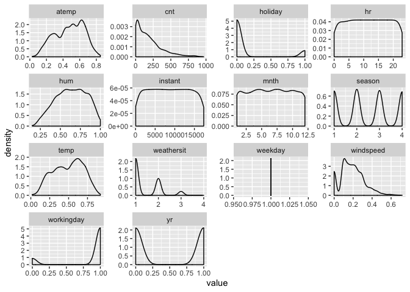
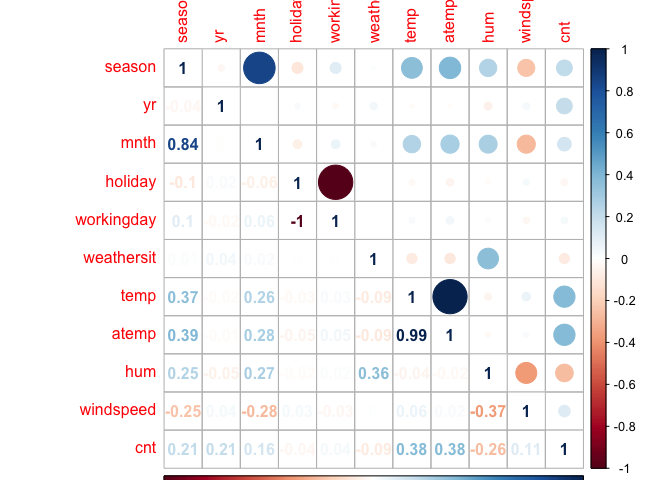

Project2
================
Lin Li

# Introduction

For this project, I will use bike sharing data to do analysis. There are
15 variables :  
\-instant(record index)  
\-dteday(date)  
\-season(1:winter, 2:spring, 3:summer, 4:fall)  
\-yr(0: 2011, 1:2012)  
\-mnth(month: 1 to 12)  
\-hr(hour:0 to 23)  
\-holiday(weather day is holiday or not)  
\-weekday(day of week)  
\-workingday(1 for neither weekend nor holiday,0 otherwise)  
\-weathersit(1: Clear, Few clouds, Partly cloudy, Partly cloudy,2: Mist
and Cloudy, Mist andBroken clouds, Mist and Few clouds, Mist,3: Light
Snow, Light Rain and Thunderstorm and Scattered clouds, Light Rain and
Scattered clouds,4: Heavy Rain and Ice Pallets and Thunderstorm and
Mist, Snow and Fog )  
\-temp(Normalized temperature in Celsius)  
\-atemp( Normalized feeling temperature in Celsius)  
\-hum(Normalized humidity),windspeed(Normalized wind speed)  
\-cnt(count of total rental bikes including both casual and registered )

The purpose of this analysis is to create models for predicting cnt
variable using others predictors mentioned above. Two models are
created:classification tree model using leave one out cross validation,
boosted tree model using cross validation.

# Data

``` r
# relative path to read data
#getwd()
day<-read.csv('day.csv')
day<-day%>%select(-c('casual','registered'))
hour<-read.csv('hour.csv')
hour<-hour%>%select(-c('casual','registered'))
# combine two data and get a new one
data<-semi_join(hour,day,by='dteday')
# filter Monday out
date<- filter(data,weekday==params$weekday)
set.seed(100)
# set train/test set
index<-createDataPartition(date$cnt,p=0.7,list=FALSE)
trainday<-date[index,]
testday<-date[-index,]
```

# Summarization

In this section, I summarize information for Monday, draw density plots
for all variables, and plot a correlation plot for cnt with others
predictors. From density plots, I can conclude the distributions for
variables. From correlation plot, I can conclude correlation
relationships between each variable.

``` r
# summary for monday
#summary(date)
# density plot
date %>%keep(is.numeric) %>%pivot_longer(everything()) %>%ggplot(aes(x = value)) +facet_wrap(~ name, scales = "free")+
geom_density()
```

<!-- -->

``` r
# all predictors' correlation with cnt variable
correlation <- cor(select(date,season,yr,mnth,holiday,workingday,weathersit,temp,atemp,hum,windspeed,cnt))
corrplot(correlation, type = "upper", tl.pos = "lt",na.label = "NA")
corrplot(correlation, type = "lower", method = "number", add = TRUE, tl.pos = "n",na.label = "NA")
```

<!-- -->

# Modeling

Two models are created for predicting cnt of Monday: First is
classification model using leave one out cross validation. Second is
boosted tree model with cross validation. I read in data and split into
training and test.Then centered and scaled data, and fitted models using
methods mentioned.  
Through comparing RMSE for test dataset, choose the one with smaller
RMSE as final model.

``` r
# fit model 
classification.fit<-train(cnt~season+mnth+hr+holiday+workingday+weathersit+temp+atemp+hum+windspeed,trainday,method='rpart',preProcess = c('center','scale'),trControl=trainControl(method='LOOCV'))
classification.fit
```

    ## CART 
    ## 
    ## 1737 samples
    ##   10 predictor
    ## 
    ## Pre-processing: centered (10), scaled (10) 
    ## Resampling: Leave-One-Out Cross-Validation 
    ## Summary of sample sizes: 1736, 1736, 1736, 1736, 1736, 1736, ... 
    ## Resampling results across tuning parameters:
    ## 
    ##   cp          RMSE      Rsquared     MAE      
    ##   0.07061600  135.9746  0.437134898   92.81922
    ##   0.09536109  162.8587  0.210934169  116.71212
    ##   0.30268930  184.2910  0.002407888  157.84868
    ## 
    ## RMSE was used to select the optimal model using the smallest value.
    ## The final value used for the model was cp = 0.070616.

``` r
boosted.fit<-train(cnt~season+yr+mnth+hr+holiday+workingday+weathersit+temp+atemp+hum+windspeed,trainday,method='gbm',preProcess = c('center','scale'),trControl=trainControl(method='repeatedcv'), verbose = FALSE)
boosted.fit
```

    ## Stochastic Gradient Boosting 
    ## 
    ## 1737 samples
    ##   11 predictor
    ## 
    ## Pre-processing: centered (11), scaled (11) 
    ## Resampling: Cross-Validated (10 fold, repeated 1 times) 
    ## Summary of sample sizes: 1564, 1564, 1563, 1564, 1562, 1563, ... 
    ## Resampling results across tuning parameters:
    ## 
    ##   interaction.depth  n.trees  RMSE       Rsquared   MAE     
    ##   1                   50      123.74676  0.5954013  84.72126
    ##   1                  100      108.57963  0.6660254  73.95147
    ##   1                  150      101.63609  0.7018441  69.63850
    ##   2                   50       95.10661  0.7455254  61.99808
    ##   2                  100       77.55411  0.8223903  52.03341
    ##   2                  150       73.53247  0.8370219  49.44259
    ##   3                   50       76.71687  0.8338113  50.40060
    ##   3                  100       62.46380  0.8818366  41.23709
    ##   3                  150       57.97259  0.8967217  38.18653
    ## 
    ## Tuning parameter 'shrinkage' was held constant at a value of 0.1
    ## 
    ## Tuning parameter 'n.minobsinnode' was held constant at a value of 10
    ## RMSE was used to select the optimal model using the smallest value.
    ## The final values used for the model were n.trees = 150, interaction.depth =
    ##  3, shrinkage = 0.1 and n.minobsinnode = 10.

``` r
# predict
class<-predict(classification.fit,newdata = testday)
classRMSE<-sqrt(mean((class-testday$cnt)^2))
boost<-predict(boosted.fit,newdata = testday)
boostRMSE<-sqrt(mean((boost-testday$cnt)^2))
#RMSE for classification model and boost model
x<-c(classification=classRMSE,boost=boostRMSE)
knitr::kable(x,col.names =' RMSE')
```

|                |      RMSE |
| -------------- | --------: |
| classification | 128.27671 |
| boost          |  56.87252 |
